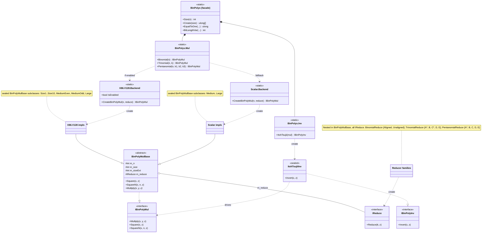

# `Org.BouncyCastle.Math.BinPoly` — Design Overview

A single, high-quality implementation of binary-polynomial (GF(2)\[x]) arithmetic — multiplication,
squaring, modular reduction, and inversion — shared by every part of the library that needs it. This
document captures the design as merged: the major decisions, why they were made, and how the pieces
fit together. It is a maintainer-facing overview, not API reference or a usage guide.

> The whole namespace is **assembly-`internal`**. "Facade", "entry point", and "API" below mean the
> surface other Bouncy Castle code uses, not a published/public API.

---

## 1. Motivation and goals

Before this work, GF(2)\[x] arithmetic was reimplemented ad hoc in several places, each with its own
representation, its own carry-less multiply, its own reduction, and its own performance and
side-channel characteristics. `BinPoly` replaces those with one core. The initial migration targets —
and what has actually been moved over — are:

- **`LongArray`**, the legacy backing of the *generic* `F2mFieldElement` (binary elliptic-curve
  fields that do not have a hand-written custom implementation);
- **`BikeRing`** (the BIKE ring `GF(2)[x]/(x^r - 1)`);
- **`Hqc.GF2x`** (the HQC polynomial layer).

Design priorities, in order:

1. **Quality** — constant-time where it matters, memory-safe, and correct by construction.
2. **Performance** — competitive carry-less-multiply kernels with hardware acceleration.
3. **Code reduction / maintainability** — treated as a consequence of the first two rather than a
   target in itself.

Realised outcomes: arithmetic that is **several multiples faster** than `LongArray`; roughly **1,200
lines removed** in the F2m rewrite plus a few hundred more across BIKE and HQC; and — beyond the raw
metrics — a **clearer, more uniform implementation that is markedly easier to read and to check for
correctness** than the disparate code it replaces. A single, well-tested core is far cheaper to audit
than four bespoke ones.

Polynomials are stored **bit-packed in `ulong[]`, little-endian word order**: bit *i* of the
polynomial lives in bit (*i* mod 64) of limb (*i* / 64). This matches the surrounding `Nat`/`Mod`
conventions and lets the kernels reinterpret the same buffer as `Vector128<ulong>` lanes with no copy.

---

## 2. Scope

Implemented today:

- **Multiplication, squaring, repeated squaring** (`Multiply`, `Square`, `SquareN`), each producing a
  fully reduced result;
- **Modular reduction** by **binomial** (`x^n + 1`), **trinomial** (`x^n + x^k + 1`), and
  **pentanomial** (`x^n + x^{k3} + x^{k2} + x^{k1} + 1`) reduction polynomials;
- **Inversion** in `GF(2^n)` via Itoh–Tsujii (field/irreducible moduli only);
- **Any degree `n`**, even or odd (including `n` a multiple of 64);
- Two interchangeable **backends**: an x86 `Vector128` PCLMULQDQ backend and a portable scalar
  fallback.

Out of scope (mentioned only abstractly under *Future extensions*): delayed reduction for
sums-of-products, `safegcd` inversion, and additional ISA backends. The hand-written per-curve
`SecT*Field` classes are a separate, independent code path and are **not** part of this work.

---

## 3. Architecture

The design is layered: a thin facade selects a reduction strategy and a backend, both hidden behind
two small interfaces; an abstract base supplies the parts that don't vary; and the variation —
operand size, instruction set, and reduction-polynomial shape — is pushed down into small **sealed**
classes that the JIT can devirtualise and inline.



**Layers, top to bottom:**

- **`BinPolys` (entry-point facade).** A static class holding the reducer-independent helpers
  (`Size`, `Create`, `Add`, `AddTo`, `Copy`, `Clear`, `One`, `EqualTo`/`EqualToOne`/`EqualToZero`,
  `BitLengthVar`) plus two nested factory classes. **`BinPolys.Mul`** classifies by reduction
  polynomial and returns an `IBinPolyMul`; **`BinPolys.Inv`** returns an `IBinPolyInv`.
- **`IBinPolyMul` / `IBinPolyInv`.** Narrow array-based interfaces (`Multiply`/`Square`/`SquareN` and
  `Invert`). Consumers depend only on these; everything below is an implementation detail. Both carry
  an explicit aliasing contract (see D8).
- **`BinPolyMulBase`.** Abstract base implementing `IBinPolyMul`. It owns the shared state
  (`m_n`, `m_size`, `m_sizeExt`, `m_reduce`), the concrete `Square`/`SquareN`, and the nested
  `IReduce` reduction abstraction with its three reducer families. Only `Multiply` is abstract.
- **Per-(size, ISA) sealed multiply impls.** Each concrete class is selected for one size band on one
  backend, calls into the matching kernel, then applies `m_reduce`.
- **Per-backend `Backend` + `Kernels`.** A `Backend` is the factory + availability gate for one ISA;
  `Kernels` holds that ISA's carry-less-multiply routines.

---

## 4. Key design decisions

### D1 — Representation and the `m_sizeExt` slack

Bit-packed `ulong[]`, little-endian, as above. The extended (pre-reduction) product buffer is always
sized `m_sizeExt = 2 · m_size` limbs. A product of two degree-`<n` polynomials has degree `≤ 2n − 2`,
so the top limb is at most partially used; tracking a tighter bound would save one limb at the cost of
extra conditional logic on every call. The fixed `2 · m_size` is the deliberate simpler choice.

### D2 — Factory + interface separation

`BinPolys.Mul.{Binomial,Trinomial,Pentanomial}(...)` is the single classification point: it inspects
the reduction-polynomial parameters `(n, k, …)`, chooses a reducer, selects a backend, and
hands back an `IBinPolyMul`. Callers never see backends or reducers, and the per-instance setup
(reducer choice, limb sizing) happens once at construction rather than on every operation. Inversion
is a sibling factory (`BinPolys.Inv.ItohTsujii`) that composes on top of an existing `IBinPolyMul`.

### D3 — Reduction as a separate, shape-specialised `IReduce`

Reduction is the part of the work that depends most sharply on the reduction polynomial, and it is the
hot path for squaring (which has no real "multiply"). So it is factored out into its own nested
`IReduce` interface and **three family factories** — `BinomialReduce`, `TrinomialReduce`,
`PentanomialReduce` — each of which fans out into small **sealed** classes specialised by *tap
relationships* and *operand size*:

- whether each tap `k` is below 64 (fits in one limb) or straddles limbs;
- the gap `n − k` (how far the folded term reaches);
- whether `n` and the taps are word-aligned (`% 64 == 0`);
- the polynomial's limb count (size-`N` unrolled variants).

The sealed leaves bake `n`/`k` into the body, fold limb-at-a-time without per-iteration branching, and
let the JIT devirtualise and inline the `Reduce` call. The alternative — one parameterised reducer
that branches on all of the above every call — is both slower and harder to verify. Word-aligned `n`
(which breaks the usual partial-top-limb shift idiom) and awkward small-gap cases get their own
dedicated reducers (`E`, `D`/`C`) rather than special-casing inside the common path.

### D4 — Per-(size, ISA) sealed multiply implementations

Multiplication is split by operand size into three regimes, each a sealed `BinPolyMulBase` subclass:

- **Fixed small sizes** (`Size1`..`Size10` on the V128 backend) use fully-unrolled kernels that keep
  every operand limb in registers — no loop, no blocking overhead.
- **Mid sizes** (`MediumEven`/`MediumOdd` on V128) use a flat, single-level arbitrary-degree
  Karatsuba.
- **Large sizes** (`Large`, both backends) use recursive Karatsuba down to a cutoff, then a leaf.

A single size-general kernel would be simpler but leaves real performance on the table at the small
sizes that dominate elliptic-curve field arithmetic. Squaring does **not** need any of this: in
GF(2), squaring is a bit-spread (insert a zero between consecutive bits) followed by reduction, so
`Square`/`SquareN` live once in the base, independent of the multiply backend.

### D5 — Two backends behind one base and interface

The same `BinPolyMulBase`/`IBinPolyMul` contract is implemented by two backends:

- **`X86.V128`** — carry-less multiply via `PCLMULQDQ` over `Vector128<ulong>` limbs.
- **`Scalar`** — a portable fallback using a 16-entry-table 1×1 multiply (works on every TFM,
  including `net461`/`netstandard2.0` and with hardware intrinsics disabled).

Backend selection happens **once, at factory time**: `BinPolys.Mul` asks `X86.V128.Backend.IsEnabled`
and, if so, builds a V128 impl; otherwise it falls through to the scalar backend. The gate goes
through the project's `Org.BouncyCastle.Runtime.Intrinsics` wrappers (never a direct
`System.Runtime.Intrinsics...IsSupported` check), so the decision is JIT-folded and there is **no ISA
branch in the inner loop**. New backends (see *Future extensions*) are added purely as siblings — a
new `Backend` + `Kernels` + impl set — with no change to the facade, interfaces, base, or reducers.

### D6 — A uniform arbitrary-degree Karatsuba leaf

Below the Karatsuba cutoff, the recursion bottoms out into a single uniform leaf per backend:
`ImplMulEven` / `ImplMulOdd` on V128 (arbitrary-degree Karatsuba over `Vector128` limbs), and the
table-based `ImplMul` on scalar. Odd lengths are handled by treating the trailing `ulong` as the low
half of a *virtual* `Vector128` whose upper half is known zero, synthesised in registers — there is no
secret-bearing padded heap copy, and the kernel is carefully arranged never to read or write the
out-of-bounds top lane. An earlier design used per-block tiled leaf kernels (`Blocks5`/`Blocks7`);
they were removed in favour of the uniform leaf, which is simpler, has no per-length coverage gaps,
and let the cutoff be re-tuned cleanly. Cutoffs (`KaratsubaCutoff` = 32 on V128, 8 on scalar) are
empirically tuned against the BIKE/HQC workloads.

### D7 — Itoh–Tsujii inversion

Inversion uses the Itoh–Tsujii identity `a^{-1} = (a^{2^{n-1} - 1})^2`, realised as a binary
addition chain on `n − 1` that drives the supplied `IBinPolyMul`'s `Multiply`/`Square`/`SquareN`. It
is therefore **backend-independent** — one implementation works for every ISA — and **branch-free on
the element value**: `0 → 0` and `1 → 1` fall out of the unconditional chain with no special case, so
the running cost depends only on the (non-secret) field size. It is correct **only for an irreducible
reduction polynomial** (i.e. a field); that is the caller's attestation, enforced by routing only the
trinomial/pentanomial factories — never the binomial ring — to `Inv`. `safegcd` could later be added
as a sibling `Inv` factory behind the same `IBinPolyInv`.

### D8 — Constant-time discipline and side-channel posture

The rule throughout: **branch only on non-secret parameters** (`n`, the taps `k`), never on element data.
The reducers and the V128 multiply path satisfy this. The one documented exception is the scalar
fallback's 16-entry table, which is indexed by 4 bits of an operand and therefore has a cache-timing
side channel — accepted as the price of a portable fallback on platforms without `PCLMULQDQ`;
deployments whose threat model includes cache-timing attackers should ensure the hardware path is
available. Secret intermediate buffers are wiped with `BinPolys.Clear` (which routes to
`CryptographicOperations.ZeroMemory` where available, so the JIT cannot elide the store), and the
`IReduce` contract explicitly states that the post-reduction contents of the extended buffer `tt` are
*arbitrary* and that wiping it remains the caller's responsibility.

### D9 — Scratch memory

The product/scratch buffers are short-lived and per-call. Small and mid-sized V128 impls
`stackalloc` the extended product buffer (governed by `StackAllocCutoff`); the recursive `Large` path
rents a single combined `tt + scratch` buffer from a private `ArrayPool<ulong>` (created with
`ArrayPool.Create`, *not* the shared pool, since the buffers carry secret partial products) and wipes
it on the way out. All scratch is threaded through the recursion as a parameter rather than stored on
the instance, so `IBinPolyMul` instances are safe to share across threads.

### D10 — Multi-TFM strategy

The portable core — `BinPolys`, the interfaces, `BinPolyMulBase`, the reducers, the scalar backend,
and `ItohTsujiiInv` — compiles on **every** target framework. The entire `X86.V128` backend is behind
`#if NETCOREAPP3_0_OR_GREATER` (where `System.Runtime.Intrinsics` exists); `Span`-based overloads are
behind `#if NETCOREAPP2_1_OR_GREATER || NETSTANDARD2_1_OR_GREATER`. On a TFM or machine without the
hardware path, the scalar backend is selected transparently and everything still works.

---

## 5. Dispatch reference

**Multiply implementation by operand size** (size = limb count = `⌈n / 64⌉`):

*X86.V128 backend — `PCLMULQDQ`, `KaratsubaCutoff = 32`:*

| size (limbs) | implementation | leaf kernel |
|---|---|---|
| 1 – 10 | `Size1` … `Size10` | fully-unrolled `ImplMul1` … `ImplMul10` |
| 11 – 31 | `MediumOdd` / `MediumEven` | single-level Karatsuba `ImplMulOdd` / `ImplMulEven` |
| ≥ 32 | `Large` | recursive Karatsuba → `ImplMulEven` / `ImplMulOdd` leaf |

*Scalar backend — table-based, `KaratsubaCutoff = 8`:*

| size (limbs) | implementation | leaf kernel |
|---|---|---|
| 1 – 7 | `Medium` | table schoolbook `ImplMul` |
| ≥ 8 | `Large` | recursive Karatsuba → `ImplMul` leaf |

**Reducer family selection** (chosen at factory time from the taps; described by discriminant
rather than by specific size boundaries):

| polynomial | discriminant | reducer |
|---|---|---|
| Binomial `x^n + 1` | `n % 64 != 0` | `BinomialReduce.Unaligned` |
| | `n % 64 == 0` | `BinomialReduce.Aligned` |
| Trinomial `x^n + x^k + 1` | `k < 64`, `n − k ≥ 64` | `TrinomialReduce.A` (+ size-unrolled `A3`..`A8`) |
| | `k ≥ 64`, `k % 64 != 0`, `n − k ≥ 64` | `TrinomialReduce.C` (+ `C5`..`C8`) |
| | `k % 64 == 0` | `TrinomialReduce.B` |
| | `n % 64 == 0`, `k % 64 != 0`, `n − k ≥ 64` | `TrinomialReduce.E` |
| | small `n − k` / remaining cases | `TrinomialReduce.D` (bit-by-bit) |
| Pentanomial `x^n + x^{k3} + x^{k2} + x^{k1} + 1` | all `k_i < 64`, `n − k3 ≥ 64` | `PentanomialReduce.A` (+ `A3`..`A8`) |
| | `k2 ≥ 64`, all `k_i % 64 != 0`, `n − k3 ≥ 64` | `PentanomialReduce.B` |
| | `k2 < 64`, `k3 ≥ 64`, `k3 % 64 != 0`, `n − k3 ≥ 64` | `PentanomialReduce.D` |
| | `n % 64 == 0`, all `k_i % 64 != 0`, `n − k3 ≥ 64` | `PentanomialReduce.E` |
| | remaining cases | `PentanomialReduce.C` (bit-by-bit) |

The `A*`/`C*` numeric suffixes are fully-unrolled variants for specific small limb counts; the plain
`A`/`C` handle the general large case via a word-fold loop. The families are dimensioned by `(n, k)`
ranges, not by any particular named curve.

---

## 6. Testing

`BinPolyTest` (~500 cases) checks every operation against an independent shift-and-XOR reference
oracle, across binomial, trinomial, and pentanomial moduli (odd, even, and word-aligned `n`), plus
the inversion round-trip, involution, and `0`/`1` fixed points. Because backend selection is internal,
the suite is run **twice** to exercise both paths: once normally (hardware `PCLMULQDQ`) and once with
`DOTNET_EnablePCLMULQDQ=0` (and/or `DOTNET_EnableHWIntrinsic=0`) to force the scalar backend. The
migrated consumers provide heavy indirect coverage on top: the generic F2m field is exercised by the
elliptic-curve point tests (`ECPointTest`, across all registered binary curves and ISA configurations),
and BIKE/HQC by their own KAT suites.

---

## 7. Future extensions

All of the following slot into the existing abstractions without touching the facade, interfaces, or
reducers:

- **More backends** — e.g. an ARM `AdvSimd`/PMULL backend, or a wider AVX-512 `VPCLMULQDQ` backend —
  added as a new `Backend` + `Kernels` + sealed impl set, gated by the same wrapper mechanism as D5.
  (Project policy: an ISA path must be validated on native hardware before it ships enabled;
  emulation proves correctness but not throughput.)
- **Delayed reduction** — a `MultiplyAcc`/`ReduceAcc`-style API for fused sums-of-products (e.g. the
  EC `a·b + c·d` patterns), implemented as twin reduce entry points on `IReduce`. Deferred because the
  current consumers do not require it for their performance wins.
- **`safegcd` inversion** — a sibling `BinPolys.Inv` factory behind `IBinPolyInv`, as an alternative
  to (or constant-time complement of) Itoh–Tsujii.

---

## Appendix — file layout

```
crypto/src/math/binpoly/
  BinPolys.cs                         facade + Mul/Inv factories
  IBinPolyMul.cs, IBinPolyInv.cs      the two interfaces
  BinPolyMulBase.cs                   abstract base, IReduce, Square/SquareN, scratch policy
  BinPolyMulBase.Binomial.cs          BinomialReduce (Aligned / Unaligned)
  BinPolyMulBase.Trinomial.cs         TrinomialReduce (A* / B / C* / D / E)
  BinPolyMulBase.Pentanomial.cs       PentanomialReduce (A* / B / C / D / E)
  ItohTsujiiInv.cs                    Itoh–Tsujii IBinPolyInv
  scalar/                             Backend, Kernels (table 1x1), Medium, Large
  x86/v128/                           Backend, Kernels.Small (Size1..10 + MulNxN),
                                      Kernels.Medium (ImplMulEven/Odd), MediumEven, MediumOdd,
                                      Size1..Size10, Large
```
